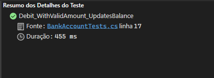

# SEM_3_M9

# O artigo

Esse artigo explica como realizar testes unitários em C#. Esse tipo de tecnologia é de extrema importância para garantir a qualidade do código, e a realização de um TDD. 

# Conceitos aprendidos

Os conceitos aprendidos foram:
    - Testes unitários em uma lingugem fortemente tipada
    - TDD
    - Testes unitários com o MSTest

# Execução de testes

Exemplo de código com falhas:

Exemplo de código com sucesso:

Estrutura do teste unitário:

# Conclusão

Com esse exercício, é possível dizer que os testes unitários, e o desenvolvimento orientado a testes são de extrema importância para garantir a qualidade do código.

